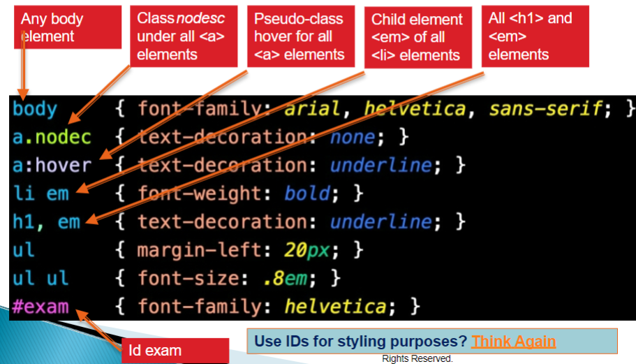
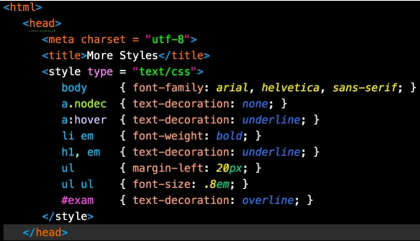
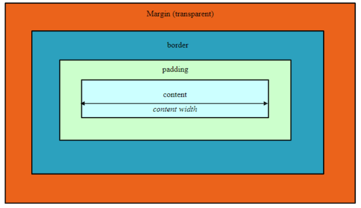

# Notes for BIT 4444 CSS

HTML defines content of a page

CSS defines style

Advantages:
- Separation of content from presentation
- Site wide consistency
- reduce data transfer over a network
- easy to reformat pages
- better acessibility

jigsaw.w3.org/css-validator/

^ this tool makes sure code is correct for CSS3-compliant browsers

```
p{  <---This is the selector
        Everthing inside is a declaration

    background-color: #FFFFFF;
    width: 100%
    ^Property ^value
}
```
## Style classes
- declarations by these are precedded by a period
use this to define a class in html

```css
.special { color: purple;}
```
This belongs to the special class declared in html
```html
<h1 class = "special">Something</h1>
```

## Pseudo Classes
- gives access to information not declared in html document
- complete list can be found in [W3 Pseudo-classes](https://www.w3schools.com/css/css_pseudo_classes.asp)


There are many different types of selectors


Prefer not to use ID's for CSS

Styles defined for parent elements are also inheritied by child(nested) elements
- Styles specificed for child have higer specificity (priority) over parent elements

Styles defined by author take precendence over user and the user styles take precedence over user agent style (browser)

### 3 Ways to specify CSS Styles
1. Inline Styles
    - declared in HTML elements
    - apply to element where style is declared
```HTML
<p style="font-size: 20pt; color:deepskyblue;" >
 This is an inline-style example.
</p>
```

2. Embedded Styles
    - declared in HTML documents head section
    - apply to entire HTML sheet


3. External Styles
    - styled defined in external style sheets
    - apply to all HTML documents on site
```html
<head>
    <title>Linking External Style Sheets</title>
    <link rel="stylesheets" type="text/css" href="styles.css"
</head>
```
## CSS fonts/text properties

**font-weight** property specified boldness of text

**font-family** property specified name of font in use

**font-size** property spcifies size used to render font
    - relative font size preferred
    - Units include px(pixels), em(size of letter M),
ex(size of letter x), in (inch), cm(centimeter)

**font-style** property allows to set text ot none, italics or oblique

**text-decoration** property applies decoration to text in an element
    - underline
    - overline
    - line-through

**text-align** property specifies if text is center, left or right

**text indent** property indents the first line of text in the element by specified amount

## CSS positioning elements
allows for **absolute positioning**

**z-index** property allows developer to layer overlapping elements

**relative positioning**
    - inline level elements do not change the flow of the document
    - block level elements displayed on their own line and have virtual boxes around them

## CSS Backgrounds
- can control backgrounds of block level elements by adding color or image

**background-image** property specifies url of image url(fileLocation)

**background-position** property places image on the pages using values of top, bottom, center and left

**background-repeat** property controls the tiling of the background
    - putting tiling to no repeat displays 1 copy of image on screen

## CSS Bloc model and text flow
**Padding**
- determines distance between content inside of element and edge of element

**Margin**
- determines distance between element's edge and any outside text

**Border**
- controlled using properties
- width, color, style


**Floating elements**
- allows to move elements to one side while other content flows around floated element

## Drop-down Menus

**:hover** 
- pseudo class

**display**
- allows programmer to determine if element should be displayed as a block, inline or not to be rendered at all

## CSS Shadows

**text-shadow**
- adds shadow effect to any text
- horizontal, vertical, blur, radius and color

**box-shadow**
- shadow effect on any block-level element

## Animation
- allows for animation wihtout JS or flash
- need to define @keyfram rule for animation

```CSS
{animation: name timing-function duration delay iteration- count
direction;}
```
- **Name:** name of the animation
- **Timing-function:** type of animation 
    - (linear, ease, ease-in, ease-out, ease-in-out cubic-bezler, etc.)
- **Duration:** time for one iteration
- **Delay:** time after the page loads and before animation begins
- **Iteration-count:** number of times animation runs 
    - a number or infinite runs possible
    - as long as within 0 and 100
- **Direction:** animation direction 
    - normal, alternate, etc.
