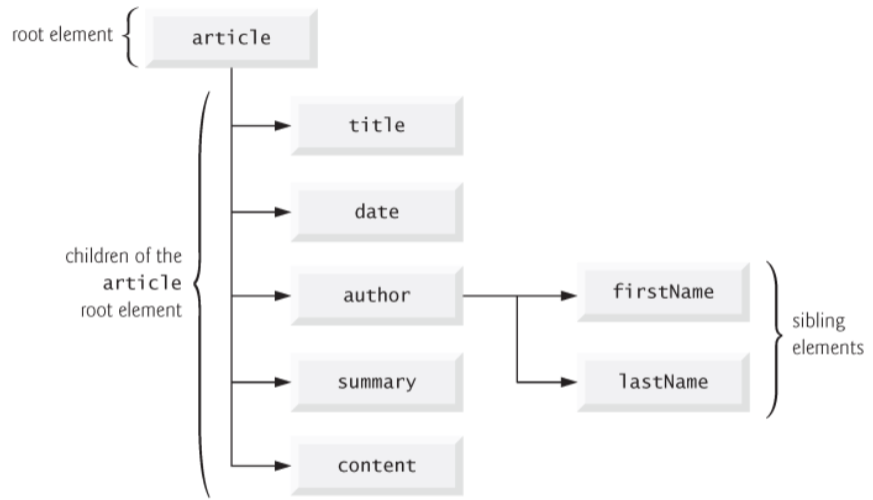
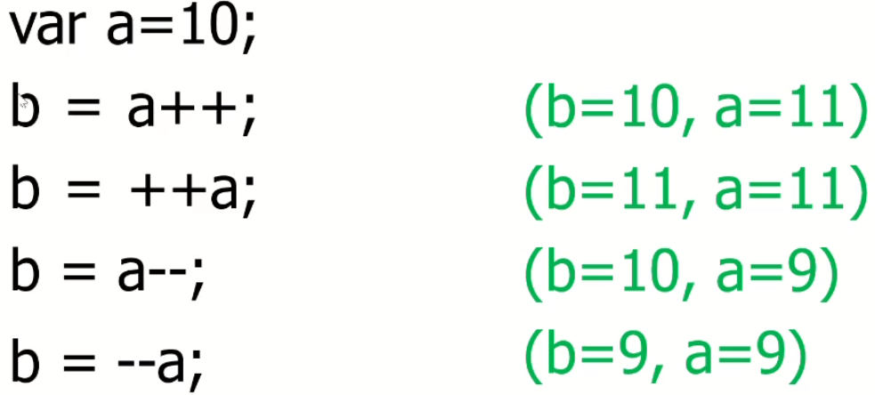
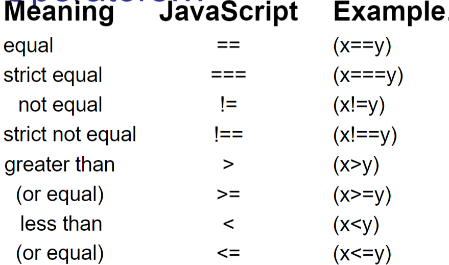
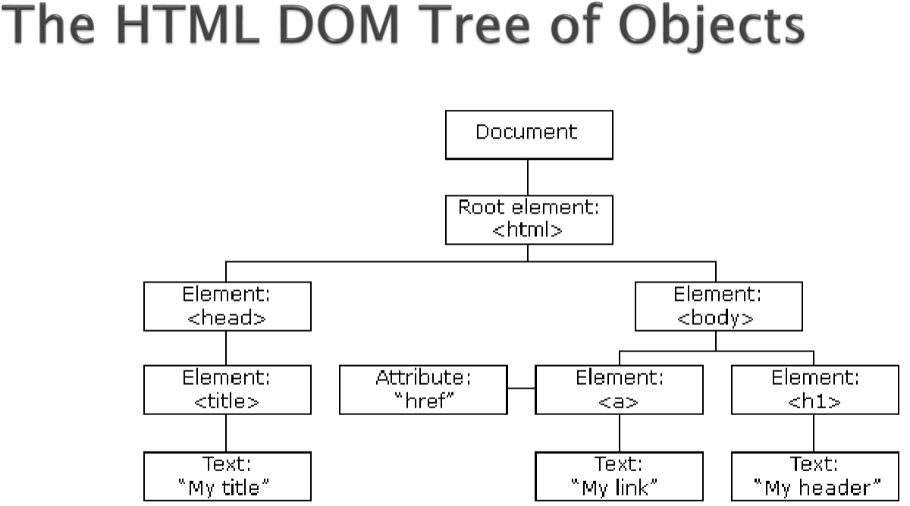
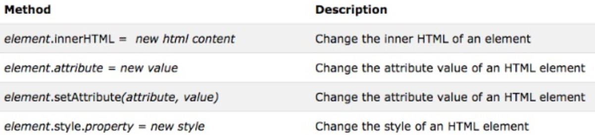
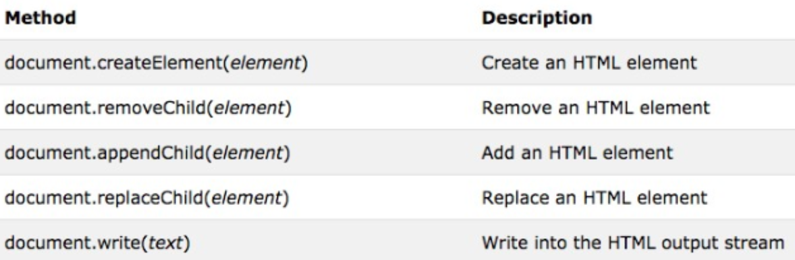

# Notes for BIT 4444 JavaScript

### **XML** (e<u>X</u>tensible <u>M</u>arkup <u>L</u>anguage):

- Permits document authors to create markup for any type of data
    - math formulas
    - chemical/molecular structures
    - music
    - recipes
- Allows for defining nodes and tags for elements
    - data type
    - data structure
- Describes data in a way humans can understand and computers can process
- Your browser **(An XML Parser)** responsible for Identifying components and storing them for later manipulation
- **Well-formed**:
    - XML document that can be parsed
- Components:
    1. XML declaration
        - ID document as XML
        - version of syntax used
    2. Contains text 
        - text represents the content
    3. Contains elements 
        - elements specify structure
            - **CASE SENSITIVE**
        - root elemet encompasses all other elements
            - must contain letter (that is not XML)

Example of Baseball player structured in XML:
```XML
<?xml version = "1.00"?>
<!--This is a comment-->
<player>
    <firstName?>John</firstName>
    <lastName>Smith</lastName>
</player>
```

## **Document  Object Model** (or DOM):

- hierarchical tree structure
- top level is the document level
- each element name is represented by node
    - can have parent and child nodes within each node
    - nodes can have siblings
    - nodes in documents page make up page's DOM tree

- DOM is the internal map of HTML/XML doc
- allows access and/or manipulation of document elements 

[More DOM stuff](#dom-part-2)

## Javascript

- Adds interactivity and visual enhancement
- Does not require server processing
- Needs client to process and can be turned off by the client due to security concerns

### Javascript is **NOT** Java

1. No GUI
2. no read/write fille access on clients
3. no class-based obj model
4. no multithreading
5. Does not need JVM(java Virtual Machine)
    - uses browser
 ### What can Javascript do?

- Control Browser features
- Modify document appearance and content dynamically
    - HTML elements
    - HTML attributes
    - CSS Styles
    - Create new HTML events
    - etc
- Store and use info about user
- Manipulate images
- React to state of browser and client system
- Visual enhancements that CSS cannot do
- Advanced animations 

### Where to write the code

There are two ways 
1. Embedded in HTML
    ```html
    <head>
        <title>Javascript template</title>
        <script type="text/javascript">
            //JS script goes here!!!
        </script>
    </head>
    ```
    - it can really be inserted anywhere realistically in HTML
    - no limit to amount of script tags that can be embedded
2. Putting it in its own file
    ```html
    <head>
        <title>Javascript template</title>
        <script src="inputValidator.js" type="text/javascript"></script>
    </head>
    ```

You can use the browser console to test your code 

## Syntax

**Variable names:**

- letters, digits, underscores and dollar signs
- cannot begin with digit
- cannot be a reserved JS keyword
- Case Sensitive
```Javascript
var varName = 1;
```

### Dynamic types and operators

- can have dynamic types
```Javascript
var length = 16; //num
var lastName = "John"; //String
var cars = ["Saab", "Volvo", "Honda"]; //Array
var x ={firstName: "John", lastName:"Doe"}; //Object
```
- It also has operators such as:
    - +,-,*,/
    - some special ones include
        - %
        - ++
        - -- 
 

### Comparison Operators:



### Logical Operators:
| Meaning | JavaScript | Example |
|---|---|---|
| AND | && | (A<B)&&(C>D) |
| OR | \|\| | (A<B)\|\|(C<D) |
| NOT | ! | !(A<B) |

### Commenting for HTML And JS

JavaScript:
```JavaScript
// Regular comment
/*    
Multi Line comment
*/
```
HTML:
```HTML
<!--HTML Comment-->
<!--
MultiLine HTML comment
-->
```
### String operators and methods

Some operators used below
```JavaScript
x = "hello " + "world" // x="hello world"
x = "hello" + 5  //x="hello5"
x = "5" + 5 //x=55
x = Number("5") + 5 //x=10
```
Here are some methods used
```JavaScript
var x = "Virginia Tech"
var y = x.length        //13
y = x.indexOf("i")      //1 bc counting from 0
y = x.lastIndexOf("i")  //6
var z = substring(9,13) //"Tech"
z = subtr(9,4)          //"Tech"
z = x.toUpperCase()     //"VIRGINIA TECH"
z = x.toLowerCase()     //virginia tech
```
### Date methods
- getHours
- getDay
- getDate
- getMinutes
- getMonth
- getFullYear

## Control structures

### If Else statements
```JavaScript
if (condition){
    //area where condition true
}
else if(other condition){
    //second condition true
}
else {
    //area where both conditions false
};
```
### Switch Statements
```JavaScript
switch(expression) {
    case n;
        //case where true
        break;
        ... //more cases afterwards
    default:
        //default code
        break;
};
```
### Loops
**While loop:**
```JavaScript
while (condition){
    //loop goes here until condition false
};
```
**Do Loop:**
```JavaScript
do{
    //code
} while (condition);
```
**For Loop:**
```JavaScript
for(statement1;condition; statement2){
    //loop code goes here
};
//Example
for (i=0;i<5;i++){
    //some code 
}
```

## Input/Output 
This is limited because of security reasons...
- **Output**
    - window.alert()
        - pop up message box
    - document.writeln or documentwrite()
- **Input**
    - window.prompt()
        - input box
    - confirm()
        - ok/cancel box
- **Debug**
    - console.log()
    - console.error()

## Functions

Functions are objects and can be referenced by a variable
- It can also be used as an argument to another function

3 ways to control a point a function was called:
1. reaching function ending brace
2. Executing return;
3. Executing return expression;

```JavaScript
function name (paramaters, if any) {
    //code goes in here
}   
```
**Anonymous Function:**
- A function without a name
```JavaScript
var obj = function(){console.log("Hello")}
```
 ## Array
 - group of variables that have the same name and are usually of same type
 - every array in Js knows its length
    - arrayName.length()
- JS arrays are ArrayObjects
```JavaScript
//this is how you initialize an arrays differently
var n1 = new Array(3) 
var n2 = [1,2,3]
```
- **push()** adds new element to end of array
- **pop()** removes the last element and returns it
- **shift()** removes first element and returns it
- **concat()** concatenates 2 arrays into 1
- **sort()** sorts an array
- **indexOf** searches array for an element and returns its index

## Events
- Allows scripts to respond to user interactions and modify page
- An event handler is a function that responds to an event
- Registering an event handler
    - assigning event handler to DOM node
- **addEventListener**
    - method that can be used to register more than 1 event handler
    - Example can be found [Here](#example-of-mouseover)
    
- If script in head attempts to get DOM node for an HTML element in the body, getElementById returns null because the body has not yet loaded
### Load Event
- executes when window finishes loading
- *Every* DOM has a load event but most commonly used in the window object

**2 Main ways for registering events:**
1. Inline Model
    - directly in HTML code
    ```JavaScript
    //This indicates that function start should be called when the bodyelement loads
    <body onload = "start()">
    ```
2. Traditional 
    - uses property of an Object to specify an event handler
    ```JavaScript
    //The following JavaScript code indicates that function start should be called when document loads
    document.onload = "start()";
    ```

### Window Object:
- represents an open window in a browser
```html
<iframe>
```
- if iframe tag is found in the html, there is a window object and an additional window for each frame
- **Window methods:**
    - alert()
    - setTimeout()
    - setInterval()
    - [etc](https://www.w3schools.com/jsref/obj_window.asp)


### Document Object
- root of HTML doc
- **Methods:**
    - getElementById()
    - writeLn()
    - write()

### Example of mouseOver
The Complete Script will look like this:
```HTML
    <script>
        function imageOver(){
            //changing image on mouseover
            document.images[0].src="/DiffImage.jpg";
        }

        function imageOut(){
            //changing on mouseout
            document.images[0].src="/original image"
        }

        function init(){
            document.images[0].addEventListener("mouseover",imageOver, false);
            //image over is the action that specifies what we do when we mouseover
            document.images[0].addEventListener("mouseout", imageOut, false);
        }

        //the paramaters are type, init is for initializing and false is the boolean
        window.addEventListener("load",init,false);

        // We need to write the function before the event listener when initializing
    </script>

```
However realistically you would be writing the following first:
```JavaScript
window.addEventListener("load",init,false);
```
Then the init function and then whatever is inside of each event listener, in this case imageOver and ImageOut.

>This is due to the fact that JS reads top bottom <br>
>Try not to call anything that has not been intitialized beforehand!

The complete example can be found in [JavaScript\Part2\Demo2.html](Part2/Demo2.html) for the complete HTML file.


## DOM Part 2

Here is a goo resource that has all HTML DOM information: 
*<u>[JavaScript and HTML DOM](https://www.w3schools.com/jsref/default.asp)</u>*


### Finding elements
HTML Elements:

```JavaScript
document.getElementById(id) // find element by id
document.getElementsByTagName(name) //find elements by tag name
document.getElementsByClassName(name) //find elements by class name
```
Example:
Returns all ```<p>``` elements with class="intro"
``` JavaScript
var x=document.querySelectorAll("p.intro");
```

You can use the (.) operator to access element attribute values
```HTML
<html>...
     ...
</html>
<script>
    var x=document.getElementById(‘myImage’);
    x.src = “newpic.jpg”;
</script>
```
### **Legacy Form Input Shortcute Accessor**
```JavaScript
var x = document.getElementsByTagName("form")[0]
x.fullName //references the fullName text input
x.address//refrences the address textarea input
```

### Properties of Nodes
You can use these to access specific elements in a document as seen in the example below
- ParentNode
    - Can only be 1
- childNodes[nodeNumber]
    - Can be more than 1 hence have to specify which one
- firstChild
- lastChild
- nextSibling
- previousSibling


**Ex:**

In this example we can see what each function would access
```JavaScript
document.getElementsByTagName("h1")[0].parentNode
//body element
document.getElementsByTagName("html")[0].firstChild
//head element
document.getElementsByTagName("html")[0].lastChild
//body element
document.getElementsByTagName("h1")[0].previousSibling
//a element
document.getElementsByTagName("a")[0].nextSibling
//h1 element
```
### DOM Collections
-  groups of related objects on a page
    - images, forms, and anchors
- can access each individual item and use functions on them
    ```JavaScript
        documents.forms.length //number of forms in the page
        documents.images[1] //second image in the page
    ```
### Changing HTML elements

### Adding elements

>^The element goes inside of ("") quotation marks inside of method parameter

To add css classes to an element you can use the ```classList``` property which has an add property
```HTML
<!DOCTYPE html> 
<html> 
<head> 
	<style> 
		.geek { 
			background-color: green; 
			font-size: 50px; 
		} 
	</style> 
</head> 
<body> 
	<button onclick="myClass()">Try it</button> 

	<div id="gfg">Geeks for Geeks</div> 
	<script> 
		function myClass() { 
			var elem = document.getElementById("gfg"); 
			// Adding class to div element 
			elem.classList.add("geek"); 
		} 
	</script> 
</body> 
</html> 
<!--Note: This was taken from GeeksForGeeks website-->
```
### Adding Event handlers
You can create and add event handlers such as the onclick event.
```JavaScript
docuemnt.getElementById(id).addEventListener("click", myFunction, false);
document.getElementById(id).onclick = myFunction;
```

