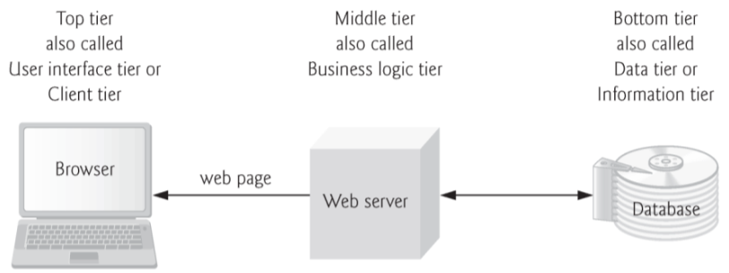

# Notes for BIT 4444 PHP

## Web application architecture

Web applications are often multilayer and divide functionality into multiple tiers that reside in multiple computers(most often than not).

|Tier|Name| Description
|---|---|---|
|Top|UI or Client Tier|The user interface the client will be interacting with.Will consist of Front end content generated by the browser(HTML,CSS, JS)|
|Middle|Business Logic or Logic Tier|Implements business logic, controller logic and presentation logic to control interactions between the application’s clients and its data (PHP, ASP.NET) |
|Bottom|Data or Information Tier|Handles the applicatiosn Data such as a Database (mySQL, Oracle). It is also know as the Back end|
___

Here is a more visual representation of the tiers


## Client-Side Scripting VS Server-Side Scripting
**Client Side**
- validate user input
- interact with browser
- enhance webapges
- add client/server communications between browser and web server

**Limitations to Client side are:**
- Browser or scripting host must be compatible/support the language
- Sensitive info cannot be validated or stored on the client
- Large amounts of JS on client can cause security issues

**Server Side Scripting**
- wider range of programmatic capabilities than client-side

**Limitations of Server Side Scripting**
- Increase demand for resources from server
- Increase network traffic
- Dependent on network Connection

## Accessing Web servers
Local web servers can be accessed through the name localhost—a
hostname that references the local machine and normally translates to the
IP address 127.0.0.1(also known as the loopback address)

A remote web server can be accessed by a domain name (which is
translated to an IP address by Domain Name Servers) or an IP address

There are different stacks for web servers:

WAMP (Windows, Apache, mySQL,and php) and MAMP (Mac, Apache, mySQL,and php)

You can install them and run them locally

# PHP
- <u>H</u>ypertext <u>P</u>reprocessing 
- language for creating dynamic web pages and always executed on the server side

## How to run PHP
- Create program using text-editor and save it with .php extension
- Then place it in web servers root folder
    - C:wamp/www for WAMP
    - /Applications/MAMP/htdocs for MAMP

## Syntax
Comments
```PHP
/*
MultiLine comment
*/

// This is a single line comment

# Another single line
```

**Variables** must be of any length >=2
- They also must begin with a $ sign
- can have underscores, numbers and letters
- Has many data types such as:
    - Integer
    - Float
    - String
    - boolean
    - Array
    - Object
- The type of variable is determined by what is assigned to it
```PHP 
$txt = "PHP";
echo "I love $txt!";
// echo is the php way of sending an output
```
**Constants** store values that cannot change at run time
    - constans are **NOT** preceeded by $ sign
    -  Usually good practice to define then in all Uppercase
```PHP
define('TIREPRICE', 100);
```

**String Concatenation**

Usually uses the ```.``` for concatenation

The Example below shows how it helps with first name and last name
```PHP
echo $fname;
echo " "; 
echo$lname;

// Is equivalent to:
echo $fname." ".$lname;
```
**Interpolation**
- This means that variables inside double quotes are interpreted
```PHP
echo “Sales total: $total U.S. dollars”;

// Is the same as
echo “Sales total: ".$total." U.S. dollars”;
```

It has the same arithmetic and logical operators as javascript except for  ```.=```.

|Operator| Use | Example |
|---|---|--|
|.=|$a.=$b|$a = $a.$b

Control Structures are the similar to Javascript as well
```PHP
if ($tireqt<10) {
    $discount = 0;
}
elseif (tireqt>=10 && tireqt<=49) {
    $discount =5;
}
else {
    //something else
}
```
Switch statement:
```PHP
switch ($find)
{
    case 'a':
    echo "foo";
    break;
    case "b":
    echo 'bar'
    default:
    echo "Char";
}
```
While Loops
```PHP
$num=1;
while ($num <=5 )
{
echo $num."<br>";
$num++;
}
```
Do While Loops
```PHP
$num=100;
do
{
echo $num."<br>";
$num++;
}
while ($num <=5 );
```
For Loops
```PHP
for($distance=50; $distance<=250; $distance += 50)
{
echo "The current distance is ".$distance."<br>";
// etc, etc
}
```
For Each Loops
- best used in arrays
```PHP
foreach( $POSTS as $value )
{
echo $value."<br>";
}
// This lists all the name-value pairs in the POSTS arra
```

**Breaking out of Loops**
- break
    - go to line following loop
- continue
    - next iteration of loop
- exit
    - terminate php program


## PHP functions to know:
```boolean isset($var)```: Determine if a variable is set is not NULL

```void unset($var)```: Destroy variable and set it to NULL

Use the keywork ```global```to redeclare a global variabel within a function before using it
```php
<?php
$num=1;
function test() {
global $num;
$num=2;
}
?>
```

## PHP System variables
- ```$_POST```: An array that contains form variable data via the HTTP POST method
- ```$_GET```: Any array that contains form variable data via the HTTP GET method
- ```$_SERVER```: An array containing data generated by the web server (e.g.,
- ```$_SERVER['PHP_SELF']``` references the currently executing script)


# State management

**Data Persistence Problem**: PHP saves using ```$_POST``` and ```$_GET``` but the variables are not saved going from page to page

- **Short Term Data Persistence**
    - Session management 
        - Each visitor gets unique session id
        - (use ```session_start()``` to start session)
        - Session data stored on a remote server in global array ```$_SESSION```
        - Temporary and will be deleted after user has left/closed browser
    - Cookies
        - small piece of data sent from web server sent locally in users browser
        - **Persistence Cookies**:
            - cookies does not expire when browser closed or user leaves site
            - expires after set amount of time
            - 7 days can be written as ```time()+60*60*24*7```
        -  Cookie will send info to server every time user visits the website
        - commonly used to track user activities
- **Long Term Data Persistence**
    - Databases
