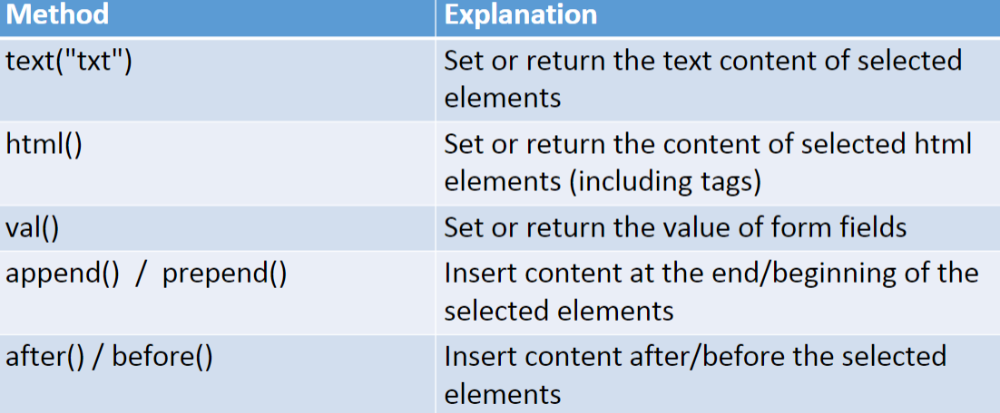
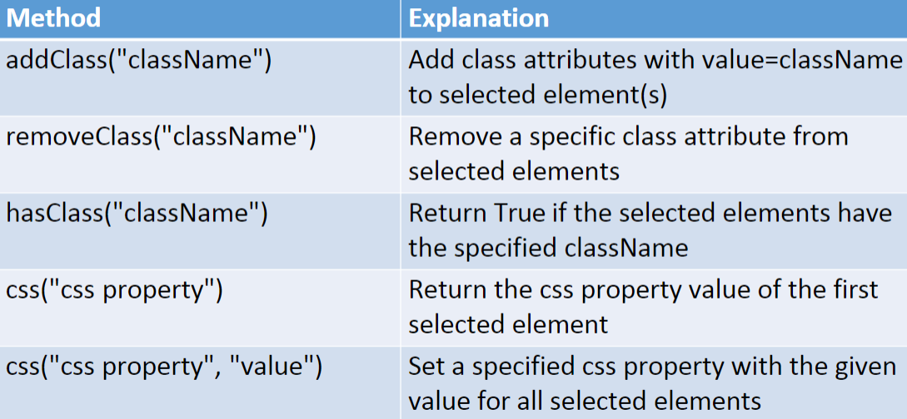

# Notes for BIT 4444 jQuery

Cross-browser JavaScript Library

**Core Elements:**
- DOM element selection and manipulation
- Handling events
- Creating animations
- Ajax applications
- Simplify JavaScript programming
- Eliminates of cross-browser incompatabilities
- Extensibility

Resource: [JQuery w3 Schools](http://www.w3schools.com/jquery/)

To reference jQuery library into doc you can use:
```HTML
<head>
    <script src="jquery-3.1.1.min.js"></script>
</head>
```
OR you can use:
```HTML
<head>
    <script src="https://code.jquery.com/jquery-3.1.1.min.js"></script>
</head>
```
When picking a jQuery version consider **file size**(compressed vs uncompressed) ,the **support to older browsers** and **other packages that use jQuery** in you web app.

## Syntax

```jQuery
$(selector:filter).action()
```
- $ stands for jQuery object
- selector selects elements
- the filter, filters selected elements
- the action is the action to be performed on the elements

### Basic Selectors

### Attribute Selector

### Form Selector

### Basic Filtering

### Manipulating HTML


### Basic Events
This event executes as soon as the document finishes loading
```JavaScript
$(document).ready(function(){
    //code here
})
```
More Events:


### CSS Manipulation
